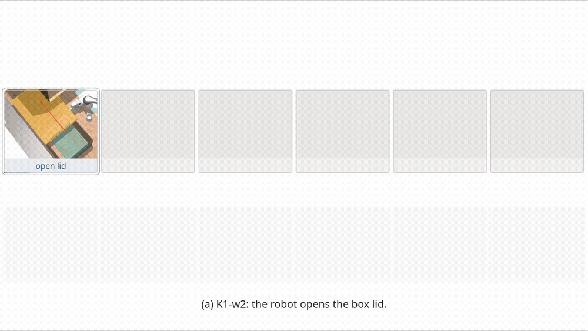

<div align="center">

# Deciding If, When, and Where to Replan for Robust Manipulation

**ROBUST-TAMP · Anonymous research release**

Selective replanning for manipulation under partial observability.

[Method](#method) · [Results](#main-comparison) · [Install](#installation) · [Quick start](#quick-start) · [Experiments](#reproducing-experiments) · [Models](#models-and-inference) · [Evaluation](#evaluation)

</div>


[Interactive framework animation](assets/media/framework.html) · Download and open the HTML locally; GitHub displays the GIF preview.

## Method

ROBUST-TAMP responds to objects revealed during manipulation. An observation memory supports three decisions:

| Decision | Role |
|:---|:---|
| **IF** | Determine whether a discovery requires correcting the current plan. |
| **WHEN** | Continue independent actions while the model plans a correction. |
| **WHERE** | Insert urgent or deferred corrections at eligible points in the remaining plan. |



[Interactive correction-placement animation](assets/media/correction-placement.html). These diagrams explain the method; they do not represent individual trial outcomes.

## Main comparison

<table>
<caption>Table 5. Comparison across 14 MuJoCo variants × 10 seeds.</caption>
<thead><tr><th rowspan="2" scope="col">Method</th><th colspan="8" scope="colgroup">Zero-shot</th><th colspan="8" scope="colgroup">With ICL</th></tr>
<tr><th scope="col">SR<sub>K</sub><br>(%) ↑</th><th scope="col">SR<sub>G</sub><br>(%) ↑</th><th scope="col">SR<br>(%) ↑</th><th scope="col">PGC<br>(%) ↑</th><th scope="col">Calls<br>/ trial ↓</th><th scope="col">Plan.<br>(s) ↓</th><th scope="col">Lat.<br>(s) ↓</th><th scope="col">Time<br>(s) ↓</th><th scope="col">SR<sub>K</sub><br>(%) ↑</th><th scope="col">SR<sub>G</sub><br>(%) ↑</th><th scope="col">SR<br>(%) ↑</th><th scope="col">PGC<br>(%) ↑</th><th scope="col">Calls<br>/ trial ↓</th><th scope="col">Plan.<br>(s) ↓</th><th scope="col">Lat.<br>(s) ↓</th><th scope="col">Time<br>(s) ↓</th></tr></thead>
<tbody>
<tr><th scope="row"><a href="https://github.com/Learning-and-Intelligent-Systems/kitchen-worlds">VLM-TAMP<br>(adapted)</a></th>
<td align="right">23.3</td>
<td align="right">6.0</td>
<td align="right">17.1</td>
<td align="right">71.4</td>
<td align="right">2.1</td>
<td align="right">77</td>
<td align="right">31.8</td>
<td align="right">176</td>
<td align="right">23.3</td>
<td align="right">10.0</td>
<td align="right">18.6</td>
<td align="right">71.9</td>
<td align="right">2.1</td>
<td align="right">85</td>
<td align="right">35.9</td>
<td align="right">183</td>
</tr>
<tr><th scope="row"><a href="https://arxiv.org/abs/2411.08253">OWL-TAMP<br>(reimplementation)</a></th>
<td align="right">17.8</td>
<td align="right">2.0</td>
<td align="right">12.1</td>
<td align="right">49.1</td>
<td align="right">6.3</td>
<td align="right">730</td>
<td align="right">115.3</td>
<td align="right">790</td>
<td align="right">17.8</td>
<td align="right">8.0</td>
<td align="right">14.3</td>
<td align="right">53.3</td>
<td align="right">6.4</td>
<td align="right">740</td>
<td align="right">114.6</td>
<td align="right">803</td>
</tr>
<tr><th scope="row"><a href="https://innermonologue.github.io/">Inner Monologue<br>(adapted prompt)</a></th>
<td align="right">64.4</td>
<td align="right">6.0</td>
<td align="right">43.6</td>
<td align="right">76.5</td>
<td align="right">14.4</td>
<td align="right">956</td>
<td align="right">62.3</td>
<td align="right">1114</td>
<td align="right">64.4</td>
<td align="right">10.0</td>
<td align="right">45.0</td>
<td align="right">76.8</td>
<td align="right">15.0</td>
<td align="right">1047</td>
<td align="right">68.4</td>
<td align="right">1240</td>
</tr>
<tr><th scope="row"><a href="https://github.com/buaa-colalab/EPoG">EPoG†<br>(without lost-object estimation)</a></th>
<td align="right">44.4</td>
<td align="right">0.0</td>
<td align="right">28.6</td>
<td align="right">48.9</td>
<td align="right">5.1</td>
<td align="right">159</td>
<td align="right">25.4</td>
<td align="right">216</td>
<td align="right">44.4</td>
<td align="right">0.0</td>
<td align="right">28.6</td>
<td align="right">48.8</td>
<td align="right">5.1</td>
<td align="right">159</td>
<td align="right">25.5</td>
<td align="right">216</td>
</tr>
</tbody><tbody>
<tr><th scope="row"><a href="#method">ROBUST-TAMP (ours)</a></th>
<td align="right"><ins><strong>94.4</strong></ins></td>
<td align="right"><ins>22.0</ins></td>
<td align="right"><ins>68.6</ins></td>
<td align="right"><ins>86.5</ins></td>
<td align="right">5.1</td>
<td align="right">540</td>
<td align="right">103.4</td>
<td align="right">643</td>
<td align="right"><strong>94.4</strong></td>
<td align="right"><strong>88.0</strong></td>
<td align="right"><strong>92.1</strong></td>
<td align="right"><strong>97.8</strong></td>
<td align="right">3.8</td>
<td align="right">355</td>
<td align="right">91.6</td>
<td align="right">449</td>
</tr>
</tbody></table>

**Reading the table.** SR is task success; SR<sub>K</sub> and SR<sub>G</sub> cover 90 kitchen and 50 grill trials. PGC is partial goal completion. Calls are mean foundation-model calls per trial; Plan. and Time are mean planning and total time; Lat. is median per-call latency. Bold marks highest reported completion; underlining marks highest zero-shot completion. Lower cost alone does not imply better task performance.

**Conditions.** All methods use Qwen3-VL-8B-Thinking. ICL affects grill only; kitchen results are shared. ROBUST-TAMP uses three examples (`examples_v3`); the baseline adaptations use two (`examples_v2`) in their respective interfaces. †The evaluated EPoG goal graph does not encode cooking. These are adaptations/reimplementations, not the original authors’ benchmark results.

**Evidence.** Seven metrics per row (70 cells) match the preserved records. The ten latency cells are transcribed from the paper because final per-call logs are unavailable. Matching historical records is distinct from reproducing results with fresh model trials.

See [baseline interfaces and adaptations](experiments/docs/baselines.md) for method-specific prompts and budgets. The table scrolls horizontally on narrow screens.

## Installation

On the **simulation client**, open a terminal in this checkout. Use Linux x86-64, Python 3.13, CMake, a C++ compiler and an EGL-capable graphics stack. FFmpeg is needed only for video. Install the pinned environment and this repository in **editable mode**, so source, task configurations and assets remain together:

```sh
python3.13 -m venv .venv-sim
. .venv-sim/bin/activate
python -m pip install -r requirements-sim.txt -e .
sh experiments/build_planner.sh
python -m robust_tamp doctor
python -m pytest -q
```

The planner build writes to `src/pddlstream/downward/builds/`; `doctor` reports imports, resources, the planner binary and content identity. Tests print their results to the terminal. No model weights or GPU are needed for installation checks or oracle simulation. Keep the checkout in place while its editable environment is active; standalone wheel installation is not supported.

<details>
<summary>Environment details and troubleshooting</summary>

The simulation pins include MuJoCo 3.10.0, NumPy 2.4.0, SciPy 1.16.3, Pillow 12.0.0 and OpenCV 5.0.0.93. NumPy 2.4.0 is retained despite its yanked status to preserve the recorded environment. The bundled historical planner uses CMake/GCC compatibility flags without changing its algorithm.

- Missing Python module: activate the environment and repeat the installation command, including `-e .`.
- EGL initialization failure: check the system graphics driver; `MUJOCO_GL=osmesa` is an alternative when OSMesa is installed. `--gui` needs a working desktop display.
- Missing planner binary: run `sh experiments/build_planner.sh` from the checkout root.
- Unavailable or mismatched model server: check the endpoint using the GPU guide before starting a batch.
- Existing output or `.run.lock`: choose a fresh directory. Remove a stale lock only after confirming its recorded process has stopped.

</details>

## Quick start

### 1. Ground-truth/oracle trial

On the **simulation client**, run one grill trial without a model server, then aggregate its evaluated outcome:

```sh
python -m robust_tamp run --method oracle --variants FINAL.G0 --seeds 0 --out runs/oracle-smoke
python -m robust_tamp aggregate runs/oracle-smoke --out runs/oracle-smoke-report
```

Trial logs and `record.json` are written under `runs/oracle-smoke/FINAL.G0/seed_00/`; the report is `runs/oracle-smoke-report/report.json`. The oracle supplies ground-truth planning decisions and runs the actual simulator/controller. It is labelled `gt_oracle`, not model performance. Success requires the evaluator's final conditions, not merely normal termination.

### 2. Model download and vLLM server

On the **GPU server**, from its checkout, check occupancy and start the selected model in a separate environment:

```sh
nvidia-smi
python3.12 -m venv .venv-inference
. .venv-inference/bin/activate
python -m pip install -r requirements-inference.txt -e .
export HF_HOME="$HOME/.cache/robust-tamp-models"
python -m robust_tamp download --model qwen3-vl-8b-thinking
python -m robust_tamp serve --model qwen3-vl-8b-thinking
```

Weights are cached under `HF_HOME`, outside the repository. Serving stays in the foreground at localhost:8000 and prints server logs. The recorded BF16 setup used an RTX 5090 with 32 GB; these GPU commands have not been tested on GPU in this release environment. For remote compute, use an authorized tunnel as described in the [model guide](experiments/docs/models.md). Leave other GPU jobs running.

### 3. One ROBUST-TAMP trial

Back on the **simulation client**, with the server reachable at the default endpoint:

```sh
python -m robust_tamp doctor --endpoint http://127.0.0.1:8000
python -m robust_tamp run --method full --variants FINAL.G0 --seeds 0 --icl paper --out runs/model-smoke
python -m robust_tamp aggregate runs/model-smoke --out runs/model-smoke-report
```

The run verifies the model/checkpoint revision and saves settings, prompts, execution events and evaluator results under `runs/model-smoke/`. The summary is `runs/model-smoke-report/report.json`. Set `--endpoint` on the run command if the server uses another address. Choose new output paths; `--resume` accepts only compatible configurations.

## Reproducing experiments

All commands in this section run from the checkout on the **simulation client**, with the selected model server running. Outputs go to the named `runs/` directories. Main evaluation uses 14 variants × seeds 0–9, six concurrent trials, a 14,400-second per-trial limit, a 1,800-second request timeout and 24,576 output tokens. The quick-start default is one concurrent trial. Model calls, controller searches and per-method budgets retain the recorded settings.

<details>
<summary>Main evaluation: zero-shot and ICL</summary>

```sh
python -m robust_tamp run --method full --seeds 0-9 --jobs 6 --out runs/main-zero-shot
python -m robust_tamp run --method full --icl paper --variants FINAL.G0 FINAL.G1 FINAL.G2 FINAL.G3 FINAL.G1-n1 --seeds 0-9 --jobs 6 --out runs/main-icl-grill
```

The first batch covers all variants. The ICL condition combines these same zero-shot kitchen trials with the second batch's five grill variants. `--icl paper` selects three-example `examples_v3` for ROBUST-TAMP; kitchen prompts stay zero-shot.

</details>

<details>
<summary>Component ablations and their coupled settings</summary>

Kitchen ablations use K1–K4, zero-shot; grill ablations use G1–G3, ICL. Each method writes separate kitchen and grill batches:

```sh
for method in no_memory no_if no_where fixed_front fixed_end no_when; do
  python -m robust_tamp run --method "$method" --variants FINAL.K1 FINAL.K2 FINAL.K3 FINAL.K4 --seeds 0-9 --jobs 6 --out "runs/ablations/$method-kitchen"
  python -m robust_tamp run --method "$method" --icl paper --variants FINAL.G1 FINAL.G2 FINAL.G3 --seeds 0-9 --jobs 6 --out "runs/ablations/$method-grill"
done
```

| Method | Evaluated change |
|---|---|
| `no_memory` | Use the current observation only. |
| `no_if` | Correct on every newly visible object. |
| `no_where` | Regenerate the remaining plan **and suspend concurrent execution**. |
| `fixed_front` / `fixed_end` | Insert every correction at the front / end. |
| `no_when` | Suspend execution during inference. |

`configs/experiments.json` specifies all flags explicitly; low-level historical defaults are not the full system. For the LLM-planner ablation, serve `qwen3-8b` and run `--method full --model qwen3-8b` on the same seven core variants and respective prompt conditions. This is a model/modality ablation, not an external baseline.

</details>

<details>
<summary>All four external baselines</summary>

```sh
for method in vlm_tamp owl_tamp inner_monologue epog; do
  python -m robust_tamp run --method "$method" --seeds 0-9 --jobs 6 --out "runs/baselines/$method-zero-shot"
  python -m robust_tamp run --method "$method" --icl paper --variants FINAL.G0 FINAL.G1 FINAL.G2 FINAL.G3 FINAL.G1-n1 --seeds 0-9 --jobs 6 --out "runs/baselines/$method-icl-grill"
done
```

These use two-example `examples_v2`, rendered in each baseline's own interface. All four implementations and their shared helpers are in `src/baselines/`. See [adaptations and budgets](experiments/docs/baselines.md). Adding `--mock` to a single baseline trial tests execution plumbing using oracle answers; it does not measure model performance.

</details>

<details>
<summary>Model and modality comparisons</summary>

Start the matching profile on the GPU server, then run both conditions on the client. For example:

```sh
python -m robust_tamp run --method full --model qwen3-8b --seeds 0-9 --jobs 6 --out runs/models/qwen3-8b
python -m robust_tamp run --method full --model qwen3-8b --icl paper --variants FINAL.G0 FINAL.G1 FINAL.G2 FINAL.G3 FINAL.G1-n1 --seeds 0-9 --jobs 6 --out runs/models/qwen3-8b-icl
```

Replace the profile on both server and client for other conditions. The client selects visual/text input and reasoning/sampling settings from the profile. Scale-study `-fp8` profiles use the official FP8 checkpoint, not an implicit conversion of BF16 weights. Outputs remain separated by model and condition.

</details>

## Models and inference

The selected model is [Qwen3-VL-8B-Thinking](https://huggingface.co/Qwen/Qwen3-VL-8B-Thinking). The registry includes the paper's Qwen3 scale/modality, Instruct/reasoning and FP8 comparisons, plus recorded alternative planners. On either installed environment, list profiles to the terminal:

```sh
python -m robust_tamp profiles
```

The [checkpoint registry and serving guide](experiments/docs/models.md#checkpoint-registry) gives official identifiers, revisions, precision, parser/template settings, access terms and recorded hardware. The selected server uses vLLM 0.30.0, BF16, a 32,768-token context and a 24,576-token output limit. Other profiles may need more memory or multiple GPUs. Stochastic decoding and time-bounded planning can vary across hardware/software; bit-identical GPU outputs are not promised.

## Evaluation

On the **client**, reconstruct preserved paper metrics into a new output directory:

```sh
python -m robust_tamp tables --extended --out runs/paper-tables
```

This writes `table5.md`, `table5.json`, and `extended/tables2-and4.md` with metric checks. Table 5 checks all 140 expected variant/seed keys for each condition and rejects duplicates or missing records. Tables 2 and 4 use the preserved metric-bearing events. To inspect other available CSVs, print summaries to the terminal:

```sh
python experiments/summarize_trial_results.py experiments/reference_results/trial_level/ablations.csv
python experiments/summarize_trial_results.py experiments/reference_results/trial_level/planner_selection.csv
```

For fresh batches, use `python -m robust_tamp aggregate RUN_DIRECTORY --out NEW_REPORT_DIRECTORY`; inspect completeness and infrastructure errors before interpreting means. Every trial stores its effective configuration and content identity, seed, prompt exchanges, JSONL events and scored result. Python, NumPy, pose jitter, IK/RRT and baseline shuffling receive the seed. Infrastructure failures are archived and rerun at most twice; task failures remain in the denominator. PGC is reconstructed from condition counts; insertion violations are analyzed separately from final goal satisfaction. See [scientific evidence and historical differences](experiments/docs/evidence.md).

<details>
<summary>Record an oracle simulation video</summary>

On the simulation client with FFmpeg installed:

```sh
SIM_BACKEND=mujoco MUJOCO_GL=egl python experiments/recording/record_variant_video.py FINAL.G0 --out runs/oracle-video --size 1280x720 --codec libx264 --seed 0
```

The recorder writes video, first/last frames and logs to `runs/oracle-video/FINAL.G0/`. Use a new directory. This records oracle execution, not the model planner.

</details>

<details>
<summary>Content identity after intentional research changes</summary>

From the checkout root, update the source/resource manifest after an intentional modification:

```sh
python experiments/freeze_release.py
```

This updates `release-manifest.json`. Subsequent runs record a new identity and refuse incompatible batch resumption. Generated builds, environments and `runs/` are excluded. Optional named joint-state snapshots use the trial working directory, or `ROBUST_TAMP_STATE_DIR` when explicitly set. Keep validation outputs separate from `experiments/reference_results/`.

</details>

## Repository map

```text
src/          Framework, four baselines, simulator/controllers, bundled planner
configs/      Experiment/ablation settings and kitchen/grill PDDL domains
assets/       Scenes, meshes, trajectories, animations and technical appendix
experiments/  Evaluation, reference records, build/recording tools and detailed guides
tests/        Unit/integration checks and deterministic fixtures
```

[Variant specifications](experiments/docs/VARIANTS.md) · [Technical appendix](assets/supplementary/supplementary_latex/supplementary.pdf)

## Limitations and acknowledgments

The CPU simulation suite, scene loading, oracle execution and preserved-record aggregation are tested. GPU-backed framework, ablation and baseline inference require configured compute; a full fresh experimental reproduction has not been performed. Seven final planner-comparison conditions and final Table 5 per-call latency records are unavailable. The working implementation postdates some reported runs; [evidence notes](experiments/docs/evidence.md) describe that boundary. Real-robot experiments are outside this release.

The simulator uses MuJoCo with a PyRep-compatible API; task/motion planning uses PDDLStream and FastDownward. Original baseline sources are linked in the comparison table. [Third-party notices](THIRD_PARTY_NOTICES.md) retain their licenses and scientific attribution. Project licensing and redistribution rights for original scene assets and reproduced prompt material remain unresolved.
