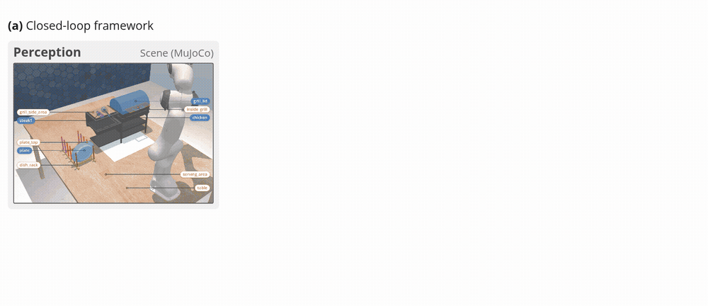

<div align="center">

# Deciding If, When, and Where to Replan for Robust Manipulation

**ROBUST-TAMP · Anonymous research release**

Observation memory · Selective replanning · Concurrent execution · Corrective insertion

</div>

ROBUST-TAMP handles manipulation tasks in which relevant objects become visible during execution. It decides **if** a discovery needs correction, **when** unaffected actions can continue during planning, and **where** urgent or deferred corrections enter the remaining plan.

[Installation](#installation) · [Quick start](#quick-start) · [Experiments](#reproducing-experiments) · [Results](#table-5--external-baseline-comparison) · [Models](docs/models.md) · [Verification](docs/verification.md)



*Framework animation.* [Open the original interactive HTML](docs/media/framework.html) locally in a browser. GitHub displays the GIF preview; it does not execute HTML animations.

## Installation

Run these commands from this release's root on the **simulation client**. Use Linux, Python 3.13, CMake, a C++ compiler and an EGL-capable graphics stack. Model inference runs in a separate GPU environment.

```sh
python3.13 -m venv .venv-sim
. .venv-sim/bin/activate
python -m pip install -r requirements-sim.txt
sh scripts/build_planner.sh
python -m robust_tamp doctor
python -m pytest -q
```

The dependency pins preserve the recorded simulation environment. The bundled planner builds locally; no personal checkout or Git submodule is needed. See [installation and troubleshooting](docs/installation.md).

## Quick start

### 1. Run a ground-truth/oracle trial

On the **simulation client**, with no model server:

```sh
python -m robust_tamp run --method oracle --variants FINAL.G0 --seeds 0 --out runs/oracle-smoke
python -m robust_tamp aggregate runs/oracle-smoke --out runs/oracle-smoke-report
```

This executes the real simulator/controller with ground-truth planning decisions. Logs and the final evaluator verdict appear in `runs/oracle-smoke/FINAL.G0/seed_00/`. It is explicitly labelled `gt_oracle` and is **not a model result**.

### 2. Start GPU inference

On your configured **GPU server**, from its release copy:

```sh
nvidia-smi
python3.12 -m venv .venv-inference
. .venv-inference/bin/activate
python -m pip install -r requirements-inference.txt
export HF_HOME="$HOME/.cache/robust-tamp-models"
python -m robust_tamp download --model qwen3-vl-8b-thinking
python -m robust_tamp serve --model qwen3-vl-8b-thinking
```

Check occupancy first. The recorded selected-model setup used an RTX 5090 with 32 GB, vLLM 0.30.0 and BF16 weights. Serving runs in the foreground on localhost:8000. For a remote server, establish your authorized tunnel as described in [GPU serving](docs/models.md). GPU commands are documented from the historical configuration and have not been smoke-tested on GPU during this release preparation.

### 3. Run ROBUST-TAMP

Back on the **simulation client**, with the endpoint accessible:

```sh
python -m robust_tamp doctor --endpoint http://127.0.0.1:8000
python -m robust_tamp run --method full --variants FINAL.G0 --seeds 0 --icl paper --out runs/model-smoke
python -m robust_tamp aggregate runs/model-smoke --out runs/model-smoke-report
```

The trial checks the served model and checkpoint revision, saves effective settings and prompts, executes the task, then evaluates the final state. A completed planning loop alone does not imply task success. Choose a new output directory for each experiment; `--resume` requires a matching configuration.

## Reproducing experiments

Use the [experiment guide](docs/reproduction.md) for exact commands for all conditions:

| Study | Release configuration |
|---|---|
| Main evaluation | `--method full`, 14 variants × seeds 0–9 |
| Zero-shot / ICL | `--icl zero_shot` / `--icl paper`; ICL affects grill only |
| Component ablations | `no_memory`, `no_if`, `no_where`, `fixed_front`, `fixed_end`, `no_when` |
| Model/modality comparisons | `--model` with a pinned [profile](docs/models.md#checkpoint-registry) |
| External comparisons | `vlm_tamp`, `owl_tamp`, `inner_monologue`, `epog` |
| Oracle ceiling | `--method oracle`; never counted as model performance |

Reported batches use six concurrent trials, a 14,400-second per-trial limit, and a 1,800-second request timeout. Default release concurrency is one for the quick start; pass `--jobs 6` for the recorded batch setting. The −WHERE ablation regenerates the remainder **and disables concurrent execution**, preserving its evaluated configuration.


*Correction placement animation.* [Interactive HTML](docs/media/correction-placement.html). These explanatory animations do not represent aggregate trial outcomes.

## Table 5 · External baseline comparison

Fourteen MuJoCo variants × ten seeds: 90 kitchen and 50 grill trials per row. All methods use Qwen3-VL-8B-Thinking. Adaptations share perception and execution; their planning interfaces and budgets differ.

ICL examples affect grill prompts only; kitchen trials are shared with zero-shot. ROBUST-TAMP uses three examples (`examples_v3`); baseline adaptations use two examples rendered in their own interfaces (`examples_v2`). See [baseline details](docs/baselines.md).

### Completion (%) ↑

| Method | Prompt | Kitchen SR | Grill SR | Overall SR | PGC |
|---|---|---:|---:|---:|---:|
| VLM-TAMP (adapted) | zero-shot | 23.3 | 6.0 | 17.1 | 71.4 |
| VLM-TAMP (adapted) | + ICL | 23.3 | 10.0 | 18.6 | 71.9 |
| OWL-TAMP (reimplementation) | zero-shot | 17.8 | 2.0 | 12.1 | 49.1 |
| OWL-TAMP (reimplementation) | + ICL | 17.8 | 8.0 | 14.3 | 53.3 |
| Inner Monologue (adapted prompt) | zero-shot | 64.4 | 6.0 | 43.6 | 76.5 |
| Inner Monologue (adapted prompt) | + ICL | 64.4 | 10.0 | 45.0 | 76.8 |
| EPoG (without lost-object estimation)† | zero-shot | 44.4 | 0.0 | 28.6 | 48.9 |
| EPoG (without lost-object estimation)† | + ICL | 44.4 | 0.0 | 28.6 | 48.8 |
| ROBUST-TAMP | zero-shot | **94.4** | 22.0 | 68.6 | 86.5 |
| ROBUST-TAMP | + ICL | **94.4** | **88.0** | **92.1** | **97.8** |

### Computational cost ↓

| Method | Prompt | FM calls / trial | Planning (s) | Call latency (s) | Total time (s) |
|---|---|---:|---:|---:|---:|
| VLM-TAMP (adapted) | zero-shot | **2.1** | **77** | 31.8 | **176** |
| VLM-TAMP (adapted) | + ICL | **2.1** | 85 | 35.9 | 183 |
| OWL-TAMP (reimplementation) | zero-shot | 6.3 | 730 | 115.3 | 790 |
| OWL-TAMP (reimplementation) | + ICL | 6.4 | 740 | 114.6 | 803 |
| Inner Monologue (adapted prompt) | zero-shot | 14.4 | 956 | 62.3 | 1114 |
| Inner Monologue (adapted prompt) | + ICL | 15.0 | 1047 | 68.4 | 1240 |
| EPoG (without lost-object estimation)† | zero-shot | 5.1 | 159 | **25.4** | 216 |
| EPoG (without lost-object estimation)† | + ICL | 5.1 | 159 | 25.5 | 216 |
| ROBUST-TAMP | zero-shot | 5.1 | 540 | 103.4 | 643 |
| ROBUST-TAMP | + ICL | 3.8 | 355 | 91.6 | 449 |

Bold denotes the best value in each column (higher completion; lower cost). Planning and total time are means per trial; call latency is the median over individual FM calls. Lower cost alone does not imply better task performance.

† The evaluated EPoG goal graph does not encode cooking. All four implementations are adaptations/reimplementations, not the authors’ official benchmark results.

**Verification:** SR, PGC, calls, planning time and total time reproduce the paper from the included trial records. Call latency is transcribed from Table 5; its final per-call records are unavailable here. Fresh trials have not reproduced this table.

## Supported models and checkpoint downloads

The selected planner is [Qwen3-VL-8B-Thinking](https://huggingface.co/Qwen/Qwen3-VL-8B-Thinking). The registry also preserves the paper's Qwen3 scale/modality profiles, Instruct and reasoning comparisons, and official FP8 checkpoints. Download only the profile you intend to run:

```sh
python -m robust_tamp profiles
python -m robust_tamp download --model qwen3-8b
```

The second command runs in the **GPU environment** and caches the pinned checkpoint under `HF_HOME`; it does not put weights in the release. [Model details](docs/models.md) include revisions, parser/template settings, output limits, recorded hardware and access requirements. Not every model fits a 32 GB GPU.

## Repository map

```text
robust_tamp/          Portable commands, configuration checks and table reproduction
llm_pipeline/         ROBUST-TAMP planning, memory, IF/WHEN/WHERE, prompts and tests
baselines/            All four external baseline adaptations and their shared helpers
mujoco_port/          Simulator shim, scenes, assets, rendering tools and tests
grill_task2/          Grill environment, controller and precomputed paths
pddl/, pddlstream/    Task domains and bundled planner sources/licenses
configs/             Explicit full-system and ablation settings
evaluation/          Task definitions, success metrics and historical analysis
reference_results/   Compact scored trials and selected metric-bearing events
scripts/, tests/     Installation helpers and release integrity tests
docs/, supplementary/ Documentation, animations and technical appendix
```

Kitchen environment/controller modules and trajectories remain at the root to preserve their existing import/resource boundaries. `vlm_pipeline/` contains shared executor/model interfaces still consumed by the framework.

## Evaluation outputs and paper tables

On the **client** (table aggregation needs only Python):

```sh
python -m robust_tamp tables --extended --out runs/paper-tables
```

This creates `table5.md`, `table5.json`, and `extended/tables2-and4.md` with verification results. It rejects incomplete or duplicate reference trial sets. Table 5's 70 available aggregate cells and Table 2's 16 domain rows match the paper. Median Table 5 call latency is retained as an explicitly labelled paper transcription because final per-call baseline records are unavailable. See [evidence and historical differences](docs/evidence.md).

Validation outputs are separate from immutable reference records. Missing final planner-comparison rows and differences between historical run code and the working snapshot are documented; fresh runs are not claimed to reproduce every historical result.

## Verified status and limitations

See [the verification report](docs/verification.md) for actual tests, oracle executions, baseline plumbing checks and remaining gaps. The GPU endpoint and full experimental matrix require configured compute. The release does not operate or reproduce the real-robot experiments.

**Sharing status:** anonymous release candidate. Source/media checks and simulation validation are documented, but project licensing and original scene/prompt redistribution permissions remain unresolved. No project license has been invented, and nothing has been published.

## Third-party acknowledgments

The four external methods are implemented here as adaptations/reimplementations. Original sources: [VLM-TAMP](https://github.com/Learning-and-Intelligent-Systems/kitchen-worlds), [OWL-TAMP paper](https://arxiv.org/abs/2411.08253), [Inner Monologue paper/project](https://innermonologue.github.io/), and [EPoG](https://github.com/buaa-colalab/EPoG). Their specific interfaces, budgets and adaptation qualifiers are documented in [baseline details](docs/baselines.md).

The simulator uses MuJoCo and a PyRep-compatible API; task/motion search uses PDDLStream and FastDownward. Third-party copyright and license notices are retained in [THIRD_PARTY_NOTICES.md](THIRD_PARTY_NOTICES.md).
