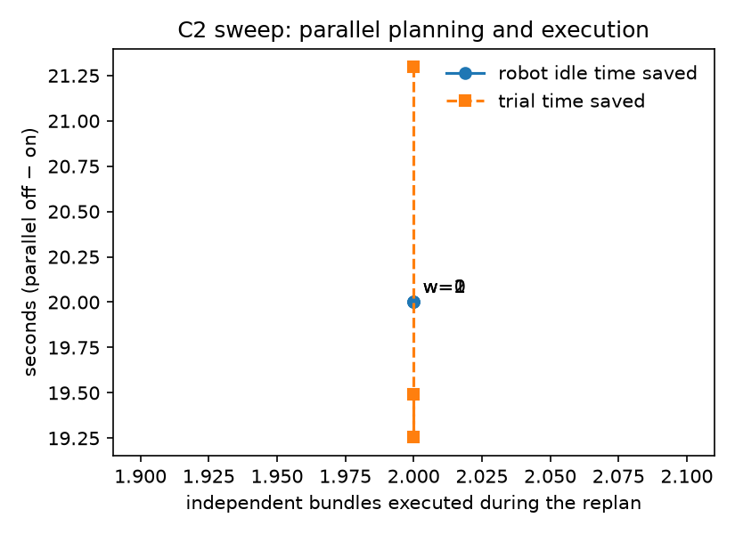

# Phase 6: WHEN (parallel planning and execution)

Oracle planner with a simulated 20 s planner latency per call. Idle time: planner latency not covered by
executing independent bundles (parallel off: the whole replan latency). Independent bundles: available
/ executed during the wait, summed over replans. Trial time from `trial_end.trial_time_s`.

| Variant | Trials | Indep. bundles available | Indep. bundles executed | Idle s (off) | Idle s (on) | Trial s (off) | Trial s (on) | Merge conflicts (on) | Success (off) | Success (on) |
|---|---|---|---|---|---|---|---|---|---|---|
| FINAL.K0 | 2 | — | — | 0.0 | 0.0 | 98.6 | 98.6 | — | 100% | 100% |
| FINAL.G0 | 2 | — | — | 0.0 | 0.0 | 94.7 | 96.5 | — | 100% | 100% |
| FINAL.K1 | 2 | 2.0 | 2.0 | 20.0 | 0.0 | 134.6 | 113.3 | 0% | 100% | 100% |
| FINAL.K2 | 2 | — | — | 0.0 | 0.0 | 103.4 | 101.7 | — | 100% | 100% |
| FINAL.K3 | 2 | 0.0 | 0.0 | 20.0 | 20.0 | 139.8 | 141.6 | 0% | 100% | 100% |
| FINAL.K4 | 2 | 3.0 | 2.0 | 20.0 | 0.0 | 143.7 | 126.1 | 0% | 100% | 100% |
| FINAL.G1 | 2 | 2.0 | 2.0 | 20.0 | 3.8 | 151.1 | 136.6 | 0% | 100% | 100% |
| FINAL.G2 | 2 | 2.0 | 2.0 | 20.0 | 3.6 | 144.9 | 131.3 | 0% | 100% | 100% |
| FINAL.G3 | 2 | 2.0 | 2.0 | 20.0 | 4.0 | 138.0 | 123.5 | 0% | 100% | 100% |
| FINAL.K3-n2 | 2 | 0.0 | 0.0 | 20.0 | 20.0 | 160.1 | 161.9 | 0% | 100% | 100% |
| FINAL.K3-n3 | 2 | 0.0 | 0.0 | 20.0 | 20.0 | 185.3 | 184.2 | 0% | 100% | 100% |
| FINAL.G1-n1 | 2 | 2.0 | 2.0 | 20.0 | 5.1 | 134.2 | 119.1 | 0% | 100% | 100% |
| FINAL.K1-w1 | 2 | 3.0 | 2.0 | 20.0 | 0.0 | 157.2 | 137.9 | 0% | 100% | 100% |
| FINAL.K1-w2 | 2 | 4.0 | 2.0 | 20.0 | 0.0 | 179.5 | 160.1 | 0% | 100% | 100% |

## C2 sweep (K1, K1-w1, K1-w2): idle time saved vs independent work

| w | Independent bundles executed | Idle time saved s | Trial time saved s |
|---|---|---|---|
| 0 | 2.0 | 20.0 | 21.3 |
| 1 | 2.0 | 20.0 | 19.3 |
| 2 | 2.0 | 20.0 | 19.5 |

